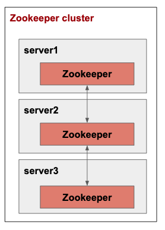

# Overview
zookeeper cluster 구축<br>
구조는 아래와 같음<br>


# Environments
* openjdk 11
* zookeeper 3.4

# Cluster setup
### Zookeeper configuration
```shell
# server1, server2, server3 모두 적용
# 자세한 configure 내용은 https://zookeeper.apache.org/doc/r3.4.14/zookeeperAdmin.html#sc_configuration 참조

# conf/zoo.cfg

tickTime=2000
initLimit=10
syncLimit=5
dataDir=/tmp/zookeeper
clientPort=2181
server.1=server1:2888:3888
server.2=server2:2888:3888
server.3=server3:2888:3888
```

### Start Zookeeper
```shell
# server1, server2, server3 모두 적용

./bin/zkServer.sh start-foreground conf/zoo.cfg
```


# Reference
* https://zookeeper.apache.org/doc/r3.4.14/
